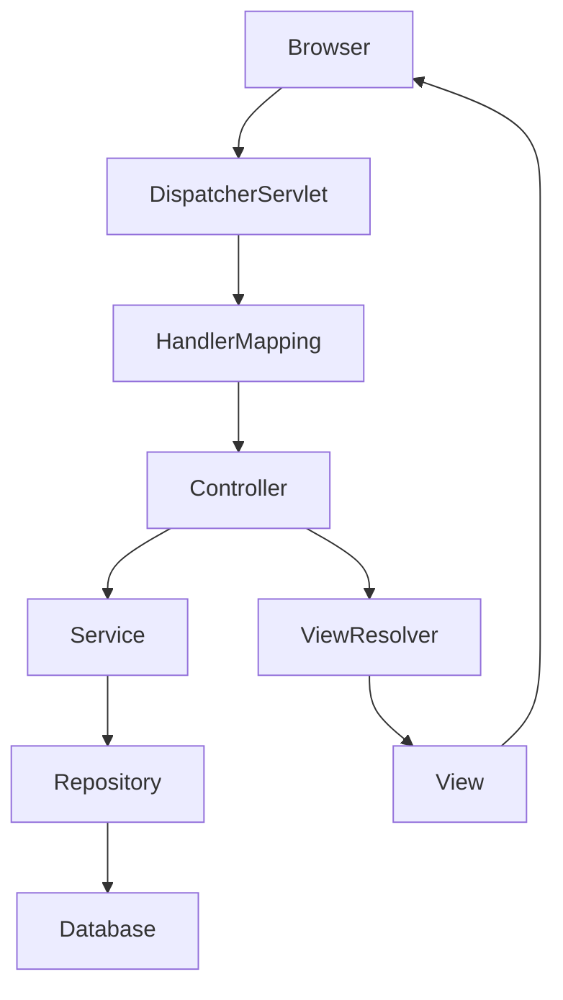
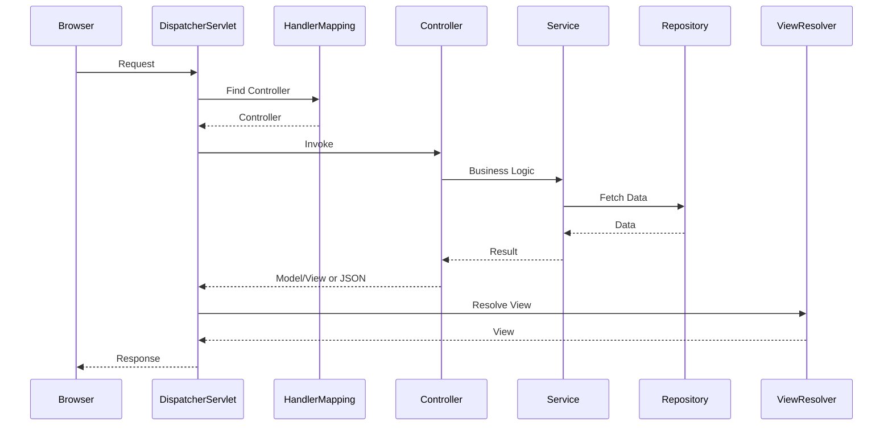
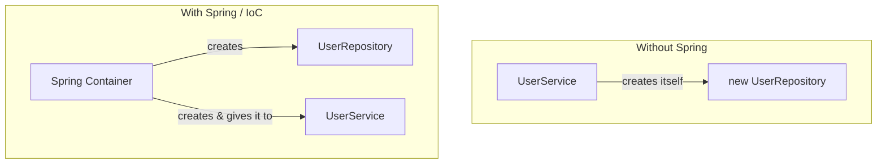
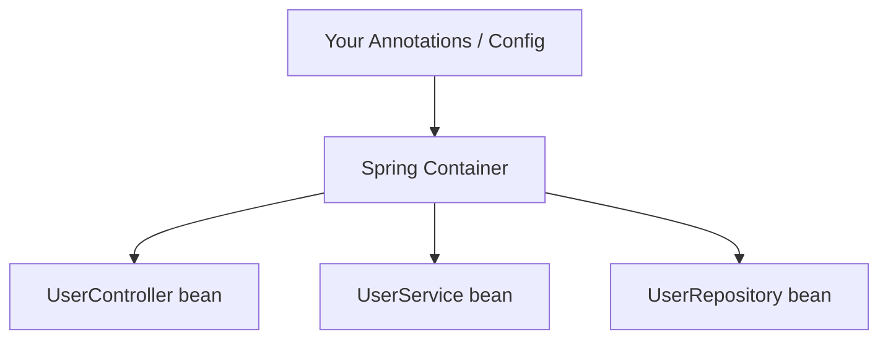
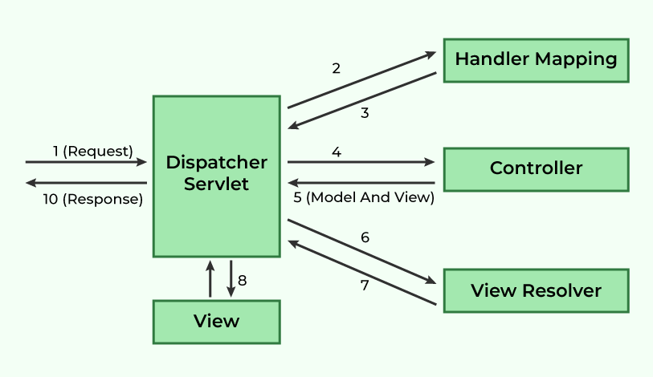
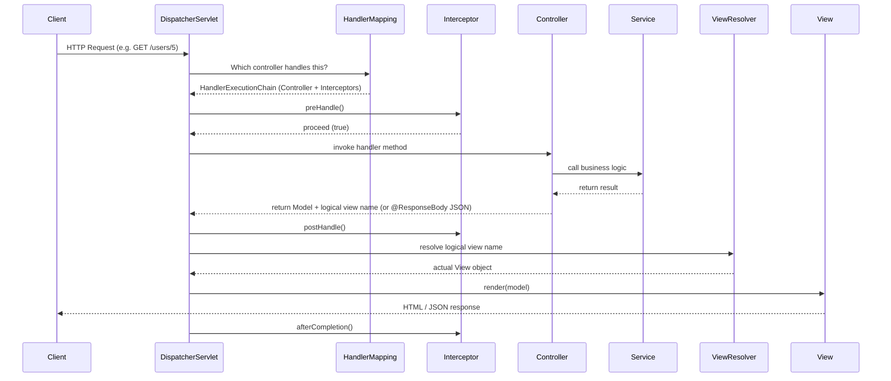
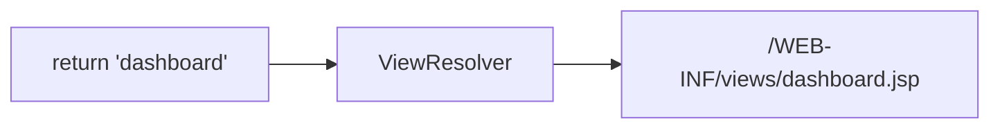
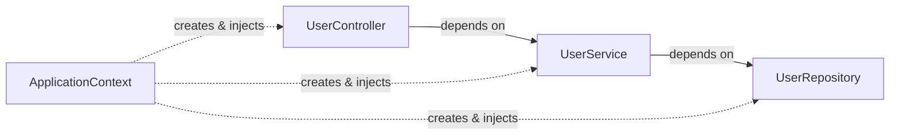

# Spring Framework and Spring MVC — Complete Beginner Guide

*A beginner-friendly guide to understanding the Spring Framework, Spring MVC architecture, IoC, Dependency Injection, and the complete request flow.*

---

## What is Spring Framework?

Spring Framework is an open-source Java framework used to build enterprise applications. It reduces boilerplate code by providing features such as Dependency Injection (DI), Inversion of Control (IoC), web development, database integration, security, and transaction management.

### Why Spring?

Developing enterprise applications using only Java requires a lot of configuration, object creation, database connectivity, transaction management, and dependency handling. Spring simplifies these tasks using IoC, Dependency Injection, MVC, Security, Data Access, and Auto Configuration, allowing developers to focus on business logic.


## Main Components of Spring Framework

- Core Container
- Spring MVC
- Spring Data
- Spring Security
- Spring Boot
- Spring AOP
- Spring Test


## Common Spring Annotations

| Annotation | Purpose |
|------------|---------|
| `@Component` | Creates a generic Spring Bean. |
| `@Controller` | Handles HTTP requests and returns a View. |
| `@RestController` | Returns JSON/XML for REST APIs. |
| `@Service` | Contains business logic. |
| `@Repository` | Handles database operations. |
| `@Autowired` | Injects dependencies automatically. |
| `@Bean` | Creates a bean from a method. |
| `@Configuration` | Configuration class for Spring Beans. |
| `@RequestMapping` | Maps URLs to controller methods. |
| `@GetMapping` | Handles GET requests. |
| `@PostMapping` | Handles POST requests. |
| `@PutMapping` | Handles PUT requests. |
| `@DeleteMapping` | Handles DELETE requests. |
| `@PathVariable` | Reads values from the URL path. |
| `@RequestParam` | Reads query parameters. |
| `@RequestBody` | Converts JSON into a Java object. |
| `@ResponseBody` | Converts a Java object into JSON. |

### How Spring Transfers Data

```text
Browser
   │
HTTP Request
   │
Controller
   │
Service
   │
Repository
   │
Database
   │
Repository
   │
Service
   │
Controller
   │
View / JSON
   │
Browser
```

**Flow**

1. Browser sends an HTTP request.
2. `DispatcherServlet` receives the request.
3. `HandlerMapping` finds the correct controller.
4. The Controller calls the Service.
5. The Service performs business logic and calls the Repository.
6. The Repository fetches data from the database.
7. Data returns to the Service and then the Controller.
8. The Controller returns a View or JSON response to the client.

### How Important Annotations Work

- **`@Autowired`** – Spring searches the IoC Container and injects the required bean automatically.
- **`@RequestBody`** – Converts incoming JSON into a Java object.
- **`@ResponseBody`** – Converts a Java object into JSON using Jackson.
- **`@PathVariable`** – Reads values directly from the URL path.
- **`@RequestParam`** – Reads values from query parameters.
- **`@ModelAttribute`** – Binds HTML form data to a Java object.

### Spring MVC Architecture (Overview)



Each component has a simple responsibility:

- **DispatcherServlet** – Receives every HTTP request.
- **HandlerMapping** – Finds the correct controller.
- **Controller** – Handles the request and calls the service.
- **Service** – Contains business logic.
- **Repository** – Interacts with the database.
- **ViewResolver** – Maps logical view names to actual pages.
- **View** – Generates the final HTML response.

## Spring MVC Request Flow



---

## Table of Contents

1. What is Spring Framework?
2. Spring Framework Components
3. Spring MVC Architecture
4. Spring MVC Request Flow
5. Inversion of Control (IoC)
6. Dependency Injection (DI)
7. Spring Container
8. Controllers
9. Model and View
10. View Resolver
11. Interceptors
12. Exception Handling
13. Working Example
14. Common Mistakes
15. References

---
## 1. The Core Idea Behind Spring: Inversion of Control

Before touching Spring MVC, it helps to understand one simple idea: **Inversion of Control (IoC)**.

In plain words: **normally, your code creates the objects it needs. With Spring, Spring creates them for you and hands them over.** That's the whole idea. "Inversion" just means the control of *who creates what* has flipped — from your code, to the framework.



In a normal Java program, an object is responsible for creating the things it depends on. Say a `UserService` needs a `UserRepository`. Without any framework, you'd write:

```java
public class UserService {
    private UserRepository userRepository = new UserRepository();
}
```

This looks harmless, but it means `UserService` is now tightly bound to one specific implementation of `UserRepository`. If you want to swap it for a mock in a test, or a different database implementation, you have to change this class. The class is *controlling* its own dependencies.

IoC flips this responsibility. Instead of the object creating its own dependencies, something external — a **container** — creates the objects and hands them the dependencies they need. The object no longer controls how its dependencies are constructed; that control has been inverted and handed to the framework.

```java
public class UserService {
    private final UserRepository userRepository;

    public UserService(UserRepository userRepository) {
        this.userRepository = userRepository;
    }
}
```

Now `UserService` just declares what it needs. Something else — Spring — decides what actual object to hand it. That "something else" is the **Spring IoC Container**.

That's it. That one shift — from "I create what I need" to "give me what I need" — is the foundation everything else in Spring is built on.

---

## 2. Dependency Injection — the mechanism that implements IoC

IoC is the *idea*. **Dependency Injection (DI)** is *how Spring actually does it* — the act of handing an object its dependencies instead of letting it build them itself. There are three common ways Spring does this:

### 2.1 Constructor Injection (recommended)

```java
@Service
public class UserService {

    private final UserRepository userRepository;

    @Autowired
    public UserService(UserRepository userRepository) {
        this.userRepository = userRepository;
    }
}
```

This is the preferred approach in modern Spring applications. It makes dependencies explicit, allows fields to be `final`, and makes the class impossible to construct in an invalid state.

### 2.2 Setter Injection

```java
@Service
public class UserService {

    private UserRepository userRepository;

    @Autowired
    public void setUserRepository(UserRepository userRepository) {
        this.userRepository = userRepository;
    }
}
```

Useful when a dependency is optional, but it means the object can exist temporarily in an incomplete state.

### 2.3 Field Injection (common, but discouraged)

```java
@Service
public class UserService {

    @Autowired
    private UserRepository userRepository;
}
```

This is the one you'll see in the most tutorials because it's short. It's also the one most experienced Spring developers avoid in real projects, because it hides dependencies, makes unit testing harder (no way to inject a mock without reflection or a Spring context), and hides circular dependency problems until runtime.

**Rule of thumb:** constructor injection by default, setter injection for optional dependencies, field injection only in quick prototypes or test classes.

---

## 3. The Spring Container

Think of the **Spring Container** as a big box that holds every object your app needs, already built and ready to use. It does three simple jobs:

1. Reads your configuration (annotations, Java config, or old-style XML)
2. Creates the objects your app needs — these are called **beans**
3. Connects (injects) those beans into each other automatically



There are two container interfaces you'll encounter:

| Interface | Description |
|---|---|
| `BeanFactory` | The basic container. Lazy-loads beans, minimal features. Rarely used directly today. |
| `ApplicationContext` | Extends `BeanFactory`. Adds event handling, internationalization, AOP integration, and eager bean loading. This is what every real Spring application uses. |

A **bean** is just an object that Spring creates and manages for you, instead of you writing `new SomeClass()` yourself. You mark a class as a bean using annotations like `@Component`, `@Service`, `@Repository`, and `@Controller`. They all do basically the same thing — they just tell Spring (and other developers) what layer that class belongs to.

```java
@Component
public class EmailValidator { }

@Service
public class UserService { }

@Repository
public class UserRepository { }

@Controller
public class UserController { }
```

At startup, Spring scans your packages (`@ComponentScan`), finds these annotations, creates one instance of each (by default, beans are singletons), and stores them in the `ApplicationContext`. From that point on, whenever a class asks for a `UserRepository`, Spring hands over the exact same managed instance and wires it in automatically.

---

## 4. What Spring MVC Actually Is

Spring MVC is Spring's web framework. It's built on the classic **Model-View-Controller** pattern, and it sits right on top of the container we just talked about. Nothing new happens here — your controllers are beans, your services are beans, everything gets wired the same way. Spring MVC simply adds one extra job on top: taking an incoming web request and routing it to the right piece of Java code, then turning the result back into an HTTP response.

The three pieces of MVC map like this in a Spring app:

- **Model** — your data. Typically POJOs / DTOs / entities passed between layers.
- **View** — what gets rendered back to the client. Could be a JSP, Thymeleaf template, or (in REST apps) a JSON representation with no "view" at all.
- **Controller** — the class that receives the request, talks to the service layer, and decides what to return.

---

## 5. The Request Flow — Step by Step

This is the part most tutorials skip. Here's the simple version first, then the detailed diagram.

**In one line:** Browser sends a request → one servlet catches everything → it finds the right controller → controller talks to your service → a page (or JSON) gets sent back.

Here's the classic Spring MVC control flow diagram, showing the same idea as 10 numbered steps:



Walking through the numbers in that picture:

1. **Request** — the browser sends a request. It goes straight to the `DispatcherServlet`, the single entry point for everything.
2. **DispatcherServlet → Handler Mapping** — it asks "which controller should handle this URL?"
3. **Handler Mapping → DispatcherServlet** — it replies with the matching controller.
4. **DispatcherServlet → Controller** — the request is forwarded to that controller.
5. **Controller → DispatcherServlet (Model and View)** — the controller does its work and hands back data (the Model) plus a logical view name.
6. **DispatcherServlet → View Resolver** — it asks "which actual file does this view name point to?"
7. **View Resolver → DispatcherServlet** — it replies with the real view (e.g. a `.jsp` file).
8. **DispatcherServlet ↔ View** — the view is rendered using the model data.
9. *(rendering completes and control returns to DispatcherServlet)*
10. **Response** — the final HTML/output is sent back to the browser.

Now here's the same flow again, but drawn as a sequence diagram with interceptors included, for a more complete technical picture:



In plain words, walking through the diagram:

1. **Browser sends a request.** No matter what URL it is, it all lands on one gatekeeper servlet: the `DispatcherServlet`. There is only ever one entry point.
2. **DispatcherServlet asks "who handles this?"** It checks `HandlerMapping`, which looks through all your `@GetMapping` / `@PostMapping` annotations to find a match.
3. **Interceptors get a first look**, if you've added any (like a login check). They can allow the request through or stop it early.
4. **Your controller method runs.** It usually calls a service, which calls a repository — all wired together by DI, same as in Section 2.
5. **Controller returns a result.** Either a view name (for a web page), or straight JSON if it's a REST controller.
6. **ViewResolver turns the view name into a real file** (like `"userProfile"` → `userProfile.jsp`), unless it's a REST response, which skips this step.
7. **The final page (or JSON) is built and sent back** to the browser.
8. **Interceptors get a last look**, mainly for cleanup or logging.

The one thing to remember: **everything goes through a single entry point** — `DispatcherServlet`. That one fact explains most of how Spring MVC behaves.

---

## 6. DispatcherServlet in Detail

Think of `DispatcherServlet` as the **front desk of a hotel**. It doesn't cook your food or clean your room — it just listens to what you need and sends you to the right department. Technically, it's a regular Java Servlet (it extends `HttpServlet`), but it doesn't do any real work itself. It just directs traffic.

It's registered against a URL pattern, commonly `/`, meaning it intercepts every request coming into the application. In a Spring Boot app, you never register this yourself — Spring Boot auto-configures it for you. In a classic non-Boot Spring MVC app, you'd register it in `web.xml` or through a `WebApplicationInitializer`:

*Spring Boot configures `DispatcherServlet` automatically, so manual registration is usually unnecessary.*

The `DispatcherServlet` internally relies on a handful of collaborator beans (all of which you can customize or replace):

| Component | Job |
|---|---|
| `HandlerMapping` | Decides which controller method should handle the incoming URL |
| `HandlerAdapter` | Actually invokes that method, regardless of its exact signature |
| `HandlerExceptionResolver` | Catches exceptions thrown during handling and decides what response to send |
| `ViewResolver` | Converts a logical view name into an actual renderable `View` |
| `LocaleResolver` | Determines locale for i18n |
| `MultipartResolver` | Parses file upload requests |

---

## 7. Controllers

A controller is just a normal bean with an `@Controller` annotation on it. Its only job is to receive a request and decide what to do about it.

There are two flavors:
- **`@Controller`** — returns a view name (a web page)
- **`@RestController`** — returns data directly (usually JSON). It's really just `@Controller` + `@ResponseBody` combined.

```java
@Controller
@RequestMapping("/users")
public class UserController {

    private final UserService userService;

    @Autowired
    public UserController(UserService userService) {
        this.userService = userService;
    }

    @GetMapping("/{id}")
    public String getUser(@PathVariable Long id, Model model) {
        model.addAttribute("user", userService.findById(id));
        return "userProfile"; // logical view name
    }
}
```

Versus the REST version, which most modern applications actually use:

```java
@RestController
@RequestMapping("/api/users")
public class UserRestController {

    private final UserService userService;

    public UserRestController(UserService userService) {
        this.userService = userService;
    }

    @GetMapping("/{id}")
    public UserDto getUser(@PathVariable Long id) {
        return userService.findById(id); // serialized to JSON directly
    }
}
```

Key annotations you'll use constantly on controller methods:

- `@GetMapping`, `@PostMapping`, `@PutMapping`, `@DeleteMapping`, `@PatchMapping` — shorthand for `@RequestMapping(method = ...)`
- `@PathVariable` — pulls a value out of the URL path
- `@RequestParam` — pulls a value out of query parameters
- `@RequestBody` — deserializes the incoming request body (usually JSON) into a Java object
- `@ResponseBody` — serializes the return value directly into the response body
- `@ResponseStatus` — sets a specific HTTP status code on the response

---

## 8. Model, ModelAndView, and Views

In the traditional (non-REST) flow, a controller needs a way to pass data to whatever template engine renders the final page. That's the `Model`.

```java
@GetMapping("/dashboard")
public String dashboard(Model model) {
    model.addAttribute("username", "vishal");
    model.addAttribute("stats", statsService.getSummary());
    return "dashboard"; // maps to dashboard.jsp / dashboard.html
}
```

You can also bundle the model and the view name into a single object, `ModelAndView`, if you prefer:

```java
@GetMapping("/dashboard")
public ModelAndView dashboard() {
    ModelAndView mv = new ModelAndView("dashboard");
    mv.addObject("username", "vishal");
    return mv;
}
```

Both approaches end at the same place: the `DispatcherServlet` hands the logical view name off to a `ViewResolver`.

---

## 9. View Resolvers

Your controller returns a short string like `"dashboard"`. But that's not a real file — someone has to turn it into one. That's the `ViewResolver`'s only job: turn a short name into the actual template file to render.



A common JSP-based configuration:

```java
@Bean
public ViewResolver viewResolver() {
    InternalResourceViewResolver resolver = new InternalResourceViewResolver();
    resolver.setPrefix("/WEB-INF/views/");
    resolver.setSuffix(".jsp");
    return resolver;
}
```

With this, returning `"dashboard"` from a controller resolves to `/WEB-INF/views/dashboard.jsp`.

If you're using Thymeleaf (very common in modern Spring Boot apps), Spring Boot auto-configures a `ThymeleafViewResolver` for you the moment `spring-boot-starter-thymeleaf` is on the classpath — no manual bean needed.

REST APIs skip this step completely, since `@ResponseBody` / `@RestController` bypasses view resolution and writes straight to the HTTP response via an `HttpMessageConverter` (Jackson, by default, for JSON).

---

## 10. Interceptors


These two get confused constantly, so it's worth being precise.

- **Servlet Filters** live outside Spring entirely — they're part of the Servlet spec, run before the request even reaches `DispatcherServlet`, and have no knowledge of which controller will eventually handle the request. Good for cross-cutting concerns like CORS headers or request logging at the raw HTTP level.

- **HandlerInterceptors** live inside Spring MVC, run *after* `DispatcherServlet` has already picked a handler, and can hook into three points: `preHandle` (before the controller runs), `postHandle` (after the controller runs, before the view renders), and `afterCompletion` (after the view has rendered, for cleanup). Good for things like authentication checks or measuring how long a specific controller took.

```java
public class AuthInterceptor implements HandlerInterceptor {

    @Override
    public boolean preHandle(HttpServletRequest request, HttpServletResponse response, Object handler) {
        if (request.getHeader("Authorization") == null) {
            response.setStatus(401);
            return false; // stops the chain here — controller never runs
        }
        return true;
    }
}
```

---

## 12. Exception Handling

Two common approaches, and you'll usually see the second one in real projects:

**Per-controller, with `@ExceptionHandler`:**

```java
@Controller
public class UserController {

    @ExceptionHandler(UserNotFoundException.class)
    public ResponseEntity<String> handleNotFound(UserNotFoundException ex) {
        return ResponseEntity.status(404).body(ex.getMessage());
    }
}
```

**Application-wide, with `@ControllerAdvice`:**

```java
@ControllerAdvice
public class GlobalExceptionHandler {

    @ExceptionHandler(UserNotFoundException.class)
    public ResponseEntity<ErrorResponse> handleNotFound(UserNotFoundException ex) {
        ErrorResponse error = new ErrorResponse(ex.getMessage());
        return ResponseEntity.status(HttpStatus.NOT_FOUND).body(error);
    }

    @ExceptionHandler(Exception.class)
    public ResponseEntity<ErrorResponse> handleGeneric(Exception ex) {
        return ResponseEntity.status(500).body(new ErrorResponse("Something went wrong"));
    }
}
```

`@ControllerAdvice` lets you centralize error handling instead of repeating the same `@ExceptionHandler` block in every controller — one class catches exceptions thrown from anywhere in the application.

---

## 13. A Complete Working Example

Putting the whole flow together — controller, service, repository, all wired through DI:

```java
// --- Repository layer ---
@Repository
public class UserRepository {
    public User findById(Long id) {
        // in reality: JPA / JDBC lookup
        return new User(id, "Vishal");
    }
}

// --- Service layer ---
@Service
public class UserService {

    private final UserRepository userRepository;

    public UserService(UserRepository userRepository) {
        this.userRepository = userRepository;
    }

    public User getUser(Long id) {
        return userRepository.findById(id);
    }
}

// --- Controller layer ---
@RestController
@RequestMapping("/api/users")
public class UserController {

    private final UserService userService;

    public UserController(UserService userService) {
        this.userService = userService;
    }

    @GetMapping("/{id}")
    public ResponseEntity<User> getUser(@PathVariable Long id) {
        return ResponseEntity.ok(userService.getUser(id));
    }
}
```

Nothing here calls `new UserService()` or `new UserRepository()` manually. Spring's IoC container creates all three beans at startup, sees that `UserController` needs a `UserService` and `UserService` needs a `UserRepository`, and wires them together automatically through constructor injection — this is IoC and DI, working exactly as described back in Sections 1 and 2, just now inside a real request-handling application.

The dependency graph looks like this:



---

## 14. Common Mistakes I See Often

- **Overusing field injection**, then wondering why unit tests need a full Spring context just to test one class.
- **Putting business logic inside controllers** instead of pushing it down into the service layer — makes controllers hard to test and reuse.
- **Forgetting `@ResponseBody` when mixing view-based and REST endpoints** in the same controller, and getting confused why Spring tries to resolve a JSON string as a view name.
- **Not understanding singleton scope** — by default every bean is a single shared instance. If you store per-request state in an instance field of a `@Service`, you'll get very confusing bugs under concurrent load.
- **Circular dependencies** between two services that both need each other — constructor injection will fail loudly at startup, which is actually a good thing; it forces you to redesign rather than silently limping along.

---

## 15. Closing Notes

Spring MVC looks big, but it really just answers two questions:

1. **Who builds my objects and connects them?** → Answered by IoC and DI.
2. **How does a web request find the right code and come back as a response?** → Answered by `DispatcherServlet`, `HandlerMapping`, and `ViewResolver`.

Once those two ideas click, everything else — interceptors, exception handling, templates — is just extra detail on top of a small, simple core.

If you ever get stuck debugging something in Spring MVC, go back to the diagram in Section 5 and ask: *which step is failing?* That usually solves it fast.

---

## References

1. Spring Framework Documentation — Web MVC Framework  
   https://docs.spring.io/spring-framework/reference/web/webmvc.html

2. Spring Framework Documentation — IoC Container  
   https://docs.spring.io/spring-framework/reference/core/beans.html

3. Spring Framework Documentation — Dependency Injection  
   https://docs.spring.io/spring-framework/reference/core/beans/dependencies.html

4. Spring Boot Reference Documentation  
   https://docs.spring.io/spring-boot/documentation.html

5. Baeldung — Spring MVC Tutorial  
   https://www.baeldung.com/spring-mvc-tutorial

6. Baeldung — Spring Dependency Injection  
   https://www.baeldung.com/spring-dependency-injection

7. Spring Guides — Building a RESTful Web Service  
   https://spring.io/guides/gs/rest-service

8. Java Servlet Specification (background on `HttpServlet` / `DispatcherServlet`)  
   https://jakarta.ee/specifications/servlet/

---

*Feel free to fork this, correct anything inaccurate, or extend it with Spring Security / Spring Data sections — happy to build those out as a follow-up.*
